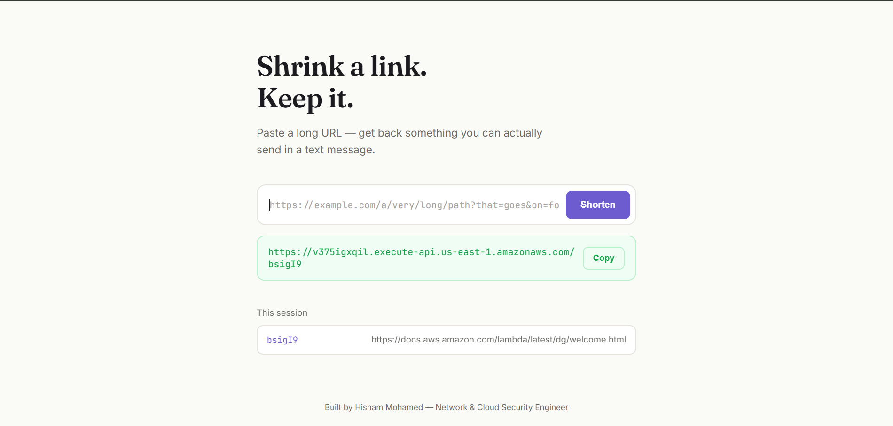
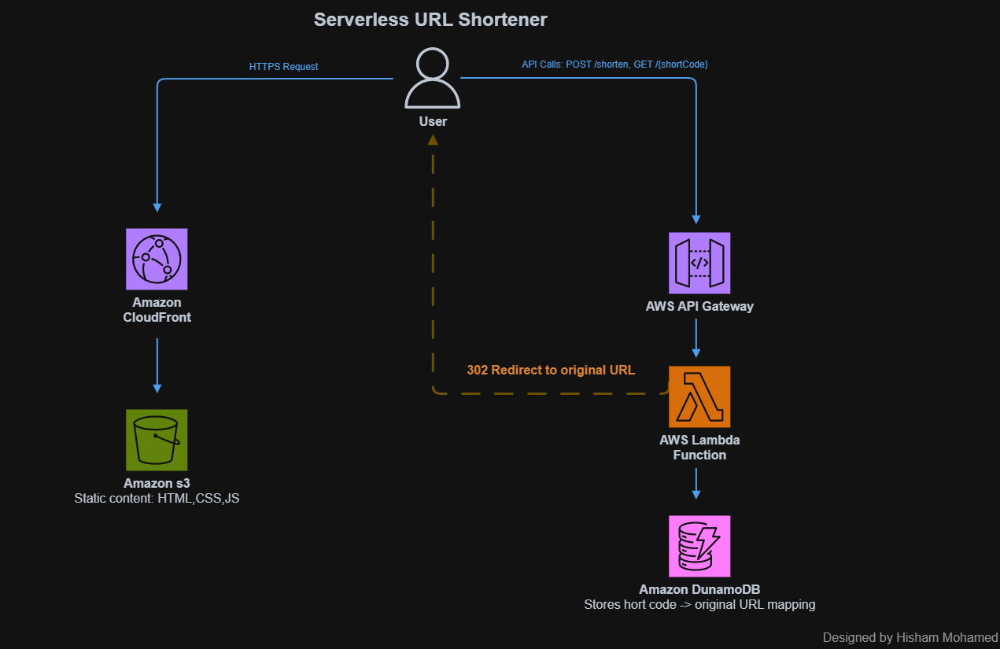

# Serverless URL Shortener

A fully serverless URL shortener built on AWS. Paste a long link, get back a short one that redirects to the original — no third-party shortening service involved.

**Live demo:** https://d11q44a19mxrj4.cloudfront.net

---

# 1. Project Overview

The **Serverless URL Shortener** does two things:

- Turns a long URL into a short, random code (`POST /shorten`)
- Redirects anyone who visits that short code back to the original URL (`GET /{shortCode}`)

The entire application — frontend and backend — is delivered without a single server to manage or patch.

## Application Preview



---

# 2. AWS Architecture



| AWS Service | Purpose |
|---|---|
| Amazon S3 | Hosts the static frontend (private, no public access) |
| Amazon CloudFront | HTTPS + CDN in front of the private S3 bucket |
| Amazon API Gateway | Routes `POST /shorten` and `GET /{shortCode}` to Lambda |
| AWS Lambda | Generates codes, writes to DynamoDB, returns JSON or a redirect |
| Amazon DynamoDB | Stores every `shortCode → long_url` mapping |
| AWS IAM | Scopes what the Lambda execution role can access |

---

# 3. Amazon S3 + CloudFront

The frontend (`index.html`, `style.css`, `script.js`) lives in a fully private S3 bucket. CloudFront reaches it via **Origin Access Control** — there's no public bucket policy, and no S3 "website endpoint" involved.

```text
User → CloudFront → S3 (private, OAC only)
```

---

# 4. API Gateway

An HTTP API with two routes, both pointed at the same Lambda function:

```text
API Gateway
│
├── POST /shorten        → creates a short code
└── GET  /{shortCode}    → looks up and redirects
```

`{shortCode}` is a **path parameter** — a variable URL segment, not a fixed route. Lambda reads it from `event["pathParameters"]["shortCode"]`.

CORS is configured explicitly: `Allow-Origin` locked to the exact CloudFront domain (no trailing slash — that alone breaks the match), `Allow-Methods: GET, POST`, `Allow-Headers: Content-Type`.

---

# 5. AWS Lambda

One function, two behaviors based on the route:

## 5.1 `POST /shorten`

```text
Request
   │
   ▼
Parse long_url from body
   │
   ▼
Generate random base62 code (6 chars)
   │
   ▼
DynamoDB PutItem, ConditionExpression="attribute_not_exists(shortCode)"
   │
   ├── success → return { short_code }
   └── collision → retry with a new code
```

## 5.2 `GET /{shortCode}`

```text
Request
   │
   ▼
Read shortCode from path parameters
   │
   ▼
DynamoDB GetItem
   │
   ├── found     → 302 redirect, Location: long_url
   └── not found → 404
```

---

# 6. Amazon DynamoDB

Single table, `UrlShortener`:

| Attribute | Type | Notes |
|---|---|---|
| `shortCode` | String (partition key) | The code itself — not a UUID, since redirects must look it up by this exact value |
| `long_url` | String | The original URL |

---

# 7. IAM Permissions

The Lambda execution role has `AmazonDynamoDBFullAccess` attached for this portfolio build. Production-grade version would scope this to `PutItem`/`GetItem` on this one table's ARN only — noted below under "Roadmap for v2."

---

# 8. Complete Workflow

```text
                    USER
                     │
        ┌────────────┼────────────┐
        │                         │
        ▼                         ▼
  Loads the tool             Submits a long URL
        │                         │
        ▼                         ▼
   CloudFront → S3          API Gateway → Lambda
                                   │
                                   ▼
                              DynamoDB (write)
                                   │
                                   ▼
                          Returns short_code

Later — someone visits the short link:

        ▼
   API Gateway (GET /{shortCode})
        │
        ▼
      Lambda
        │
        ▼
   DynamoDB (read)
        │
        ▼
  302 redirect → original URL
```

---

# 9. Project Structure

```text
serverless-url-shortener/
├── docs/
│   ├── architecture.png
│   └── app-preview.png
├── frontend/
│   ├── index.html
│   ├── style.css
│   └── script.js
├── backend/
│   └── lambda_function.py
└── README.md
```

---

# 10. Lessons This Project Actually Taught Me

- `GET /{shortCode}` matches *any* single path segment — including an accidental request to a misspelled route. Route design has to account for that overlap.
- A CORS `Allow-Origin` with a trailing slash doesn't match the browser's `Origin` header (which never has one) — one stray character, and every request silently fails CORS.
- An HTTP redirect from Lambda is just a `Location` header plus a `3xx` status code — no special SDK feature required.
- DynamoDB's `ConditionExpression="attribute_not_exists(...)"` enforces uniqueness on write, without needing a separate read first.

---

# 11. Roadmap for v2

- [ ] Scope the Lambda role to least-privilege (this table only)
- [ ] Add TTL-based link expiration using DynamoDB's native TTL
- [ ] Map the frontend and redirect endpoint to one custom domain, so short links don't expose the raw API Gateway URL

---

# 12. Conclusion

The **Serverless URL Shortener** demonstrates a complete request lifecycle on AWS with no servers involved: private static hosting, path-parameter routing, conditional writes for uniqueness, and native HTTP redirects — built and debugged end to end as a hands-on portfolio project.

Built by **Hisham Mohamed** — Network & Cloud Security Engineer.
